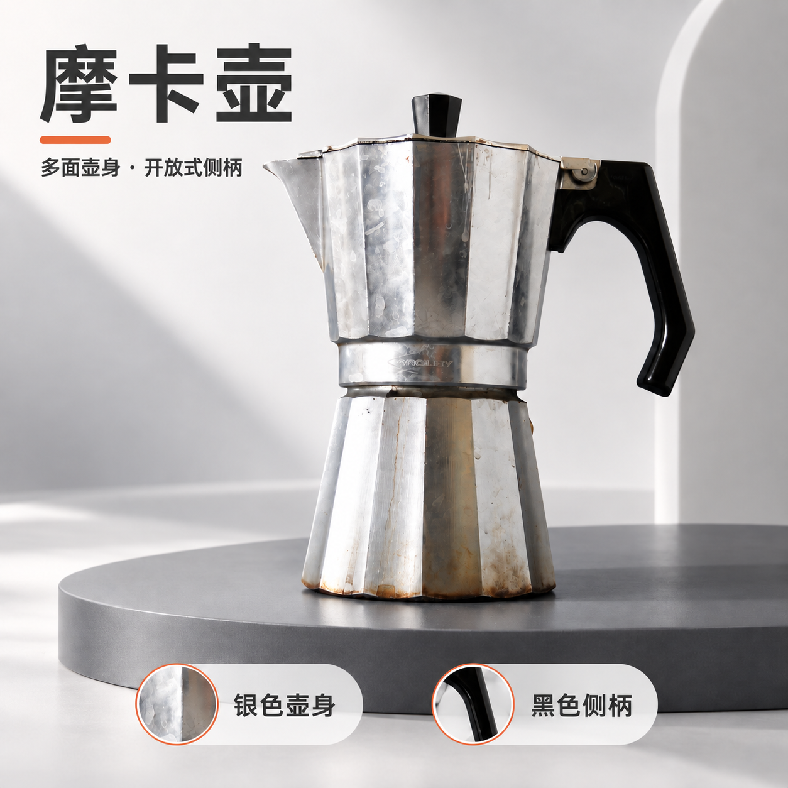

# Picvero｜发商品照片，交电商套图与文案

[](https://github.com/jidouqie/picvero/actions/workflows/ci.yml) · [MIT 许可](LICENSE) · [下载安装包](https://github.com/jidouqie/picvero/releases/latest)

**只发商品照片，自动按款归类：发几款就完整做几套，每款五张电商图、上架文案与详情页草稿。**

面向电商卖家和运营，一次完成整套上新素材。Picvero 自主设计主视觉、纯净展示、特点页、场景与设计解析，配齐标题、卖点、描述和详情页。每张图默认生成一次，制作前定好布局与文案，制作后核对并保留具体问题。参数与风格偏好有就补充，没有也能开始。

## 第一次怎么用

1. 安装 `picvero`，在技能列表中找到 **Picvero（电商套图与文案）**。
2. 调起后直接发商品照片。同款多照合并参考，不同款分别制作；每款连续完成五张有明确分工的套图和文案。
3. 在回复内切换大图与缩略图，从“打开完整展示页”浏览完整 HTML，再按需下载素材或查看上架文案。若只要一张、只要图片或指定三张，直接说明即可。

Picvero 自动做设计选择、生成和检查；不会先问你要主图还是场景图、喜欢哪种颜色。照片已经提供时直接开始；只调起技能还没发图时，会先简短介绍用途和怎么开始。

```text
$picvero
（附上商品照片）
```

## 可以得到什么

| 你想做的事 | 交付结果 |
| --- | --- |
| 只发一件商品的照片 | 五张套图＋标题、卖点、描述＋详情页草稿 |
| 同时发多款商品照片 | 自动按款归类，每款完整五图＋文案＋HTML，附整批汇总与下载包 |
| 给一件商品做完整展示 | 风格一致的主图、卖点图、场景图等独立图片 |
| 同一张图需要英文版 | 翻译后的图片与原译文对照 |
| 准备上架文字 | 商品标题、卖点和描述；需要时提供详情页草稿 |
| 多件商品要一起做 | 按商品分别整理的图片和可继续处理的进度 |
| 担心 AI 把商品改坏 | 原图与成图对照检查、问题说明与修改建议 |

## 默认交付与生成次数

默认五个图位：**商业主视觉、纯净展示、核心特点、场景氛围、设计解析／购买信息**，加三个标题、三到五条有依据的卖点、商品描述、配图文案及详情页草稿。默认安排不同机位、摆放和表现方式。多张同商品照片按角度结合使用；单张也允许 AI 推演新视角，并在图注明确。资料不足时不虚构尺码、材料，也不把推演结构当作实拍证据。

每个图位各生成一次，五张套图通常是五次不同内容的调用。不会先反复修改同一张样图，也不将一张拼图代替五张独立图片。生成图仍要对照原图检查，问题随图保留；没大问题直接交付，大问题简短指出；只有用户明确要求修改时才做新版本。

## 后续每件商品都按同一完成度制作

默认采用同等的设计标准与交付范围：有冲击力的首图、有变化的镜头、商品专属风格、完整文案和 HTML。每次根据当前商品重新策划，不设品类白名单，交换机、瓶盖、开瓶器及非常规物品都按同一标准处理；依其实际形态与用途设计，不机械套用同一个案例。原图清晰度、品类复杂度与工具表现会影响实际效果；统一执行标准不等于承诺每件商品都能精确还原。[具体标准](shared/references/visual-direction.md)。

## 多角度与多样式

一张或多张商品照片都可开始。Picvero 查看全部照片后自动按款归类，同款多照共用一套，不同款全部分别制作；三款默认三套、十五张图，无须预先提供 SKU 或确认分组。每款默认五图通常包含至少三种明显不同的观察方向或商品姿态，并结合广告主视觉、纯净棚拍、生活场景和编辑式特点页。统一商品特征与整套视觉，镜头、动作和布景按图位变化。

同商品多角度照片会作为互补依据；不同 SKU 与颜色变体分开。只有单图时也可生成新角度，图注明确“AI 推演视角”，不承诺不可见部分的精确还原。指定多种风格时按要求分组，不自动将角度与风格相乘扩大数量。[具体约定](shared/references/multi-view.md)。

## 最终回复的默认呈现

完成标题 → 回复内大图与可切换缩略图 → **打开完整展示页** → 一句实际交付摘要 → 下载全部素材 / 查看上架文案。只在有具体待核对或未完成事项时补一句说明。

HTML 是查看完整成果的主入口，图片和文案集中展示，支持电脑与手机浏览。多款商品各有独立的图片、文案与详情页，并提供汇总 HTML 和整批 ZIP。回复内图廊按商品分组，优先使用宿主可用的交互能力；不可用时保留真实图片预览和 HTML 链接。展示区只复用成图，不增加生图次数。[详细交付约定](shared/references/delivery.md)。

## 看一个实际例子

| 商品原照 | 生成的电商展示图 |
| --- | --- |
|  |  |

[看完整四张套图](examples/marketplace-suite/README.md) · [看全部功能演示](examples/all-skills-demo/README.md)

本例为真实公有领域照片的 AI 编辑演示，保留原物旧痕；细小刻字与纹理仍待核对。图片生成后会检查，不把生成成功直接当作商品完全保真。

历史样例与报告保留制作时的旧名称和提示记录。现在使用主入口 `$picvero`；旧示例中的 `huoying-能力` 对应 `picvero-能力`。

## 安装

推荐下载 **[picvero-0.5.6.zip](https://github.com/jidouqie/picvero/releases/download/v0.5.6/picvero-0.5.6.zip)**，解压后把 `picvero` 文件夹放入 `~/.agents/skills/`。一个技能就能完成上面的任务，其余七个技能是可选的快捷入口。需要全部入口时，下载 [八技能完整包](https://github.com/jidouqie/picvero/releases/download/v0.5.6/picvero-skills-0.5.6.zip)。

需要具备内置图片生成能力的 Codex 会话；本包不附带模型，也不提供独立生图服务器。本地文件整理工具需要 Python 3.10+，核心运行不需要额外 Python 依赖。

从源码使用或参与开发：

```bash
git clone https://github.com/jidouqie/picvero.git
cd picvero
python3 tools/build.py
```

构建后，安装包位于 `dist/`。无需先构建即可直接使用仓库中已生成的 `skills/`。

在本项目启用全部技能：

```bash
python3 tools/install.py --dest .agents/skills --link
```

复制全部技能到个人目录：

```bash
python3 tools/install.py --dest ~/.agents/skills
```

安装程序不联网、不覆盖同名技能。也可以只把主入口包中的技能文件夹放进个人技能目录；若仍显示旧名称或简介，退出并重新打开 Codex，刷新后再核对菜单。[更多使用方式](docs/主入口使用说明.md)。

## 按需要直接调用

| 技能 | 列表中显示的用途 |
| --- | --- |
| `picvero` | 电商套图与文案：默认完整交付 |
| `picvero-image` | 商品单图修改 |
| `picvero-suite` | 商品套图制作 |
| `picvero-localize` | 商品图片翻译 |
| `picvero-brand` | 店铺图片风格 |
| `picvero-batch` | 批量商品做图 |
| `picvero-review` | 商品图片检查 |
| `picvero-listing` | 商品上架文案 |

当前版本 0.5.6，代码与技能采用 MIT 许可。项目名称为 Picvero。主技能名为 `picvero`，其他能力使用 `picvero-能力`。制作图片使用当前 Codex 会话的内置工具，不需要其他生成平台账号或单独的图片 API Key；Codex 自身的工具可用性与额度仍然适用。

## 视觉设计

按实际电商套图的方法策划商品识别、核心特点、局部依据、场景与选择信息。支持查看用户指定的商品链接/参考图，提炼构图与视觉体系，按当前商品重新设计；不移植参考商品的参数或品牌。设计依据见 [平台套图研究](research/电商套图样式研究.md)。

[查看 0.3.0 新版套图样例](examples/marketplace-suite/README.md)：商品概览、侧柄特点、可见细节和咖啡角场景四个图位，含实际审图与定点修正记录。

默认按商业主视觉的完成度制作：第一张突出商品和主题，纯净图看清商品，特点与场景页展开不同信息；通过光影、空间、配色和排版形成视觉冲击。保留商品真实外观，不用编造材质、参数或细节换取效果。历史案例见 [视觉升级样例](examples/premium-look/README.md)。

## 能力边界

- 商品与风格参考分开；来源不明的参数不写成事实。
- 每张最终候选都要查看原图与结果，unknown 不自动通过。
- 本地记录区分生成、检查、用户选用，审核不会自动替卖家选图。
- 文件与原图变化会使旧记录需要重新确认，不只凭 SKU 跳过。
- 每个图位默认生成一次；检查不触发自动重做，有问题的保留状态并继续其余交付。用户要求修改时按指定图位制作新版本。
- 基础规格检查覆盖尺寸、格式、字节、比例等；RGB 纯白、准确主体分割和平台实际审核不在首版自动确认范围内。
- 单图不能证明不可见结构；复杂试穿、精细标签、跨语言图片与大规模批量仍需实际商品验证。
- 不自动发布、不强制加水印、不把商品图传到作者服务器。

## 本地工具与依赖

`shared/scripts/runtime.py` 负责任务快照、结果版本、审核记录、基本检查、HTML 预览和 ZIP。它不联网、不读取密钥、不调用图片 API，也不做位图编辑。

Python 3.10+ 标准库可运行。Pillow 是可选的只读解码／透明像素检查增强；没有时明确报告未检查。正常用图不需要用户手写 JSON，Codex 按技能说明准备。

## 验证

完整使用演示见 [八个技能实演与流程解读](examples/all-skills-demo/README.md)：真实摩卡壶照片完成白底、主视觉、特点页和翻译，加入水勺验证两 SKU 续做、问题记录与一次定点修正，同时提供品牌文件、文案和详情草稿。

0.5.6 共 44 项自动测试、8 个官方技能格式校验通过。测试覆盖每图一次的默认限制、某图失败后继续其他图，以及品牌改名后的技能名称与用途。0.5.6 固化“自动按款归类，发几款就完整做几套”，同步主入口、批量说明与多款交付格式；本轮未重新生图，未新增多商品自动归类的实际生图验证。此前已完成黑鞋多角度和透明修正带的五图、文案、图廊与 HTML 实演；用户确认的视觉与交付形式不代表精细保真或平台审核通过。更早的真实 CC0 照片测试完成了白底、场景、中文特点图和英文翻译。

实际测试发现细纹理会被重构，因此四张保留“待核对”状态；默认不会作为合格图片自动导出。工作流可运行与商品完全保真是分别验证的两件事。

- [0.2.0 测试报告](docs/测试报告-0.2.0.md)
- [真实照片测试](examples/web-photo-test/README.md)
- [原图与成图对照](examples/web-photo-test/delivery/index.html)
- [文案与详情草稿](examples/web-photo-test/listing.md)
- [早期虚构样本记录](examples/README.md)

自动测试：

```bash
python3 -m unittest discover -s tests -v
```

虚构固定样本的本地归档回放，不会再次生图：

```bash
python3 tools/replay_sample.py --out /tmp/picvero-demo-new
```

### 常用本地功能

Codex 通常会按技能说明代为操作；开发者也可以直接使用运行器：

```bash
python3 shared/scripts/runtime.py import-csv --csv catalog.csv --out request.json
python3 shared/scripts/runtime.py show --run /path/to/run --sku A001 --shot main
python3 shared/scripts/runtime.py select --run /path/to/run --sku A001 --shot main --version 1 --decision selected --note "用户选择第一版"
python3 shared/scripts/runtime.py export --run /path/to/run --out delivery-v2 --selected-only
```

CSV 导入只建立草稿，供应商描述不自动变为确认事实。已存在的请求与交付目录不会被覆盖。

## 开发与命名

修改 `skill_sources/` 和 `shared/`，再构建：

```bash
python3 tools/build.py
```

`skills/` 是生成结果，`dist/` 是安装 ZIP。若生成目录被手动修改，构建器会停止，保护改动。每个技能附带自己的运行文件，避免只安装一个技能时引用断裂。

以后改名只需改 `project.json` 的 `name` 与 `prefix`，再构建，主技能采用无后缀的 prefix，其余技能采用 prefix-capability；技能目录、frontmatter、列表显示名称、默认提示和内部引用会一起更新。列表显示 `Picvero Image`、`Picvero Suite` 等独立英文名称，中文用途放在简介；实际调用名仍为 `picvero-image`、`picvero-suite`。命名切换已有自动测试。已安装到项目或个人目录的旧前缀要另行处理，不自动删除用户技能。

## 项目资料

- [参与贡献](CONTRIBUTING.md)
- [公开发布范围与演示记录说明](docs/开源发布说明.md)
- [示例素材来源](THIRD_PARTY_NOTICES.md)
- [项目思路](项目思路.md)
- [开源项目拆解](research/开源项目拆解.md)
- [真实需求调查](research/真实需求调查.md)
- [参考来源快照](research/来源快照.json)

本实现独立编写，吸收参考项目的工作流方法；未复制其生成执行器、账号系统或素材。研究材料中的外部链接用于查证，不是技能运行依赖。


## 示例素材

代码使用 MIT 许可。真实照片测试的原图来自 Wikimedia Commons，按其 [CC0 来源记录](examples/web-photo-test/source.json) 使用。测试成图明确属于 AI 编辑结果，不是新的真实拍摄或商品认证。
