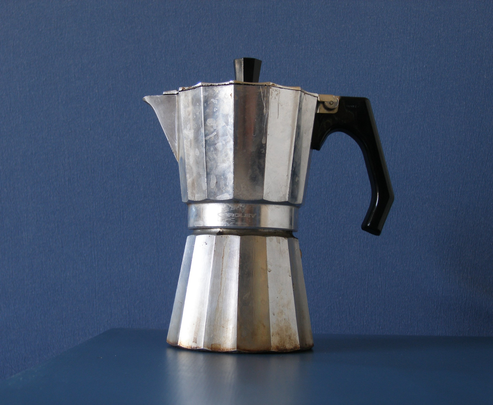
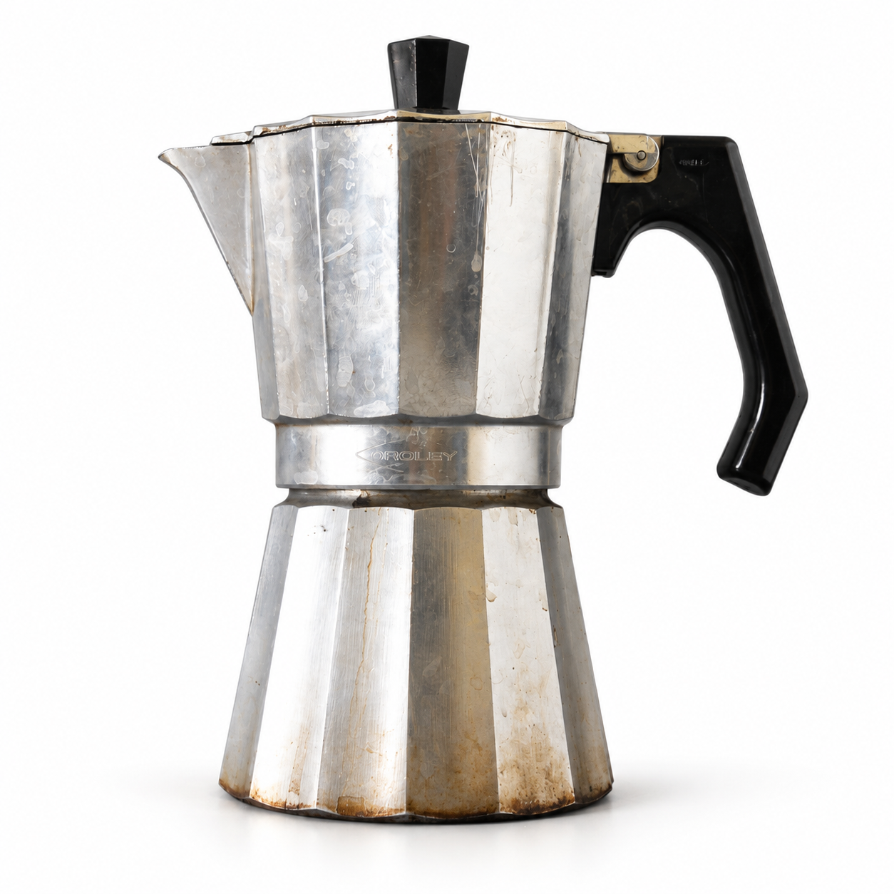
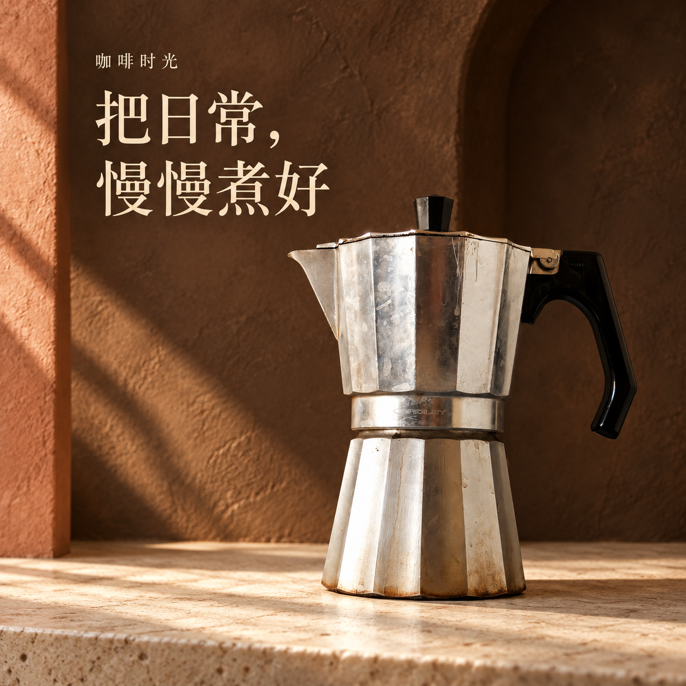
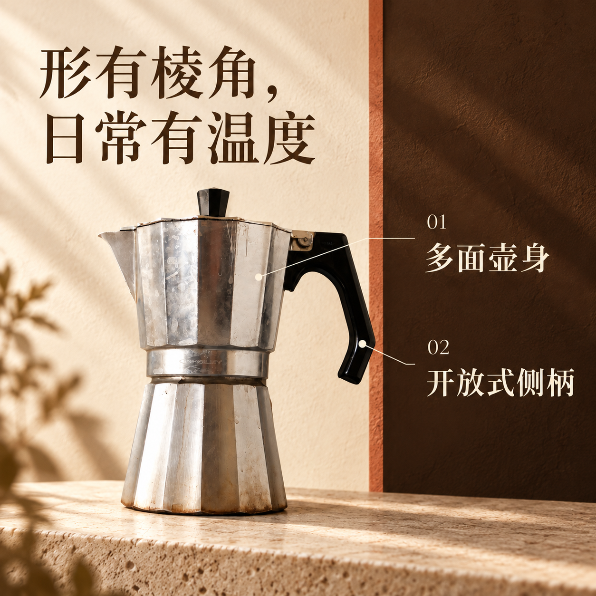
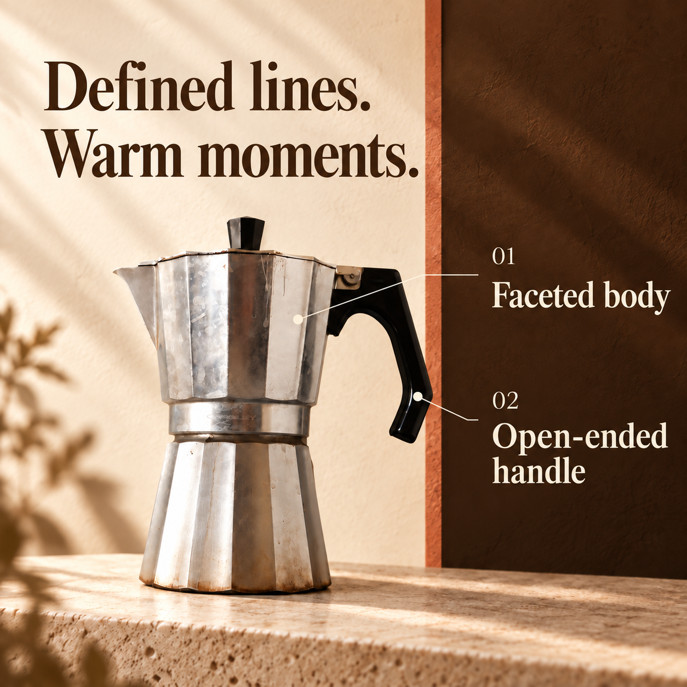
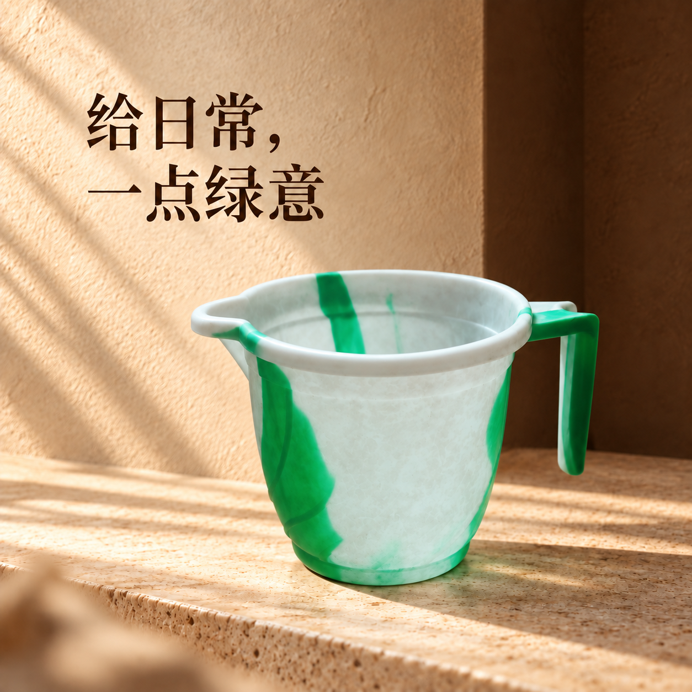
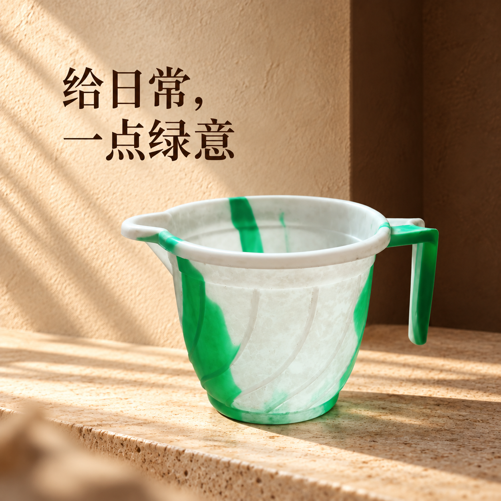

# 货映：8 个技能完整实演与使用流程

本次在 Codex 中依照 0.2.1 版的八项技能完成真实操作，日期为 2026-09-15。主案例是一张真实的旧摩卡壶照片，批量部分加入之前测试过的绿白水勺。两件物品分别建档，共完成 5 个图位、6 次内置图片工具调用，包含一次定点修正。全部原图、成图、实际提示、检查结果和状态记录均随本目录保存。

[打开图文演示页](index.html) · [商品详情页草稿](detail.html) · [原图与成图记录](delivery/index.html)

## 先理解它怎么用

货映是一组由 Codex 执行的工作说明与本地工具。你把照片和需求交给 Codex，Codex 负责看图、设计、调用内置图片工具、核对和整理。你不需要自己写提示词文件、商品数据或状态记录。

常用入口是 **`huoying-studio` 工作台**。它按任务使用相关能力，不需要每次把八个技能依次调用一遍。八个技能也不等于八张图：工作台产出任务安排，品牌产出风格规范，批量产出有对应关系的素材和记录，审图产出检查报告，文案产出文字与详情草稿。

通常的顺序是：

**提供商品 → 整理事实与图片计划 → 确定视觉方向 → 制作 → 对照原图检查 → 局部修改 → 交付。**

需要英文就增加翻译，需要多商品就增加批量；只有一张换背景需求，可以直接进入单图制作。

## 01 · huoying-studio：工作台

**你可以这样说：**

> 用 $huoying-studio，为这张商品实拍制作上新素材。先整理可见特点，再做一张白底图、一张有品牌感的场景图、一张特点图，并配上标题和描述。不要补造我没提供的参数。

**这次实际做了什么：**建立两件商品的资料；把摩卡壶安排为白底、主视觉、中文特点、英文特点四个图位；把水勺安排为批量中剩余的一个主视觉图位；保存了可继续读取的任务。

| 原图可观察 | 仍然未知，不能擅自补齐 |
| --- | --- |
| 银色多面壶身、上下壶体与中段圆环 | 实际材质成分、容量、尺寸 |
| 黑色顶钮、左侧壶嘴、右侧开放式侧柄 | 炉具兼容性、使用性能、认证 |
| 水渍、划痕、底沿褐色旧痕 | 商品品牌型号、包装包含物 |

SKU `MOKA001`、`SCOOP001` 只是本次演示编号，不是制造商型号。没有将刻字猜测变成已确认品牌。原图不是卖家供货资料，因此文案属于外观演示草稿。

## 02 · huoying-brand：品牌风格

**你可以这样说：**

> 用 $huoying-brand，把这组参考图的配色、光线、排版整理成我们店铺的视觉规范，以后这个店铺的商品都沿用。

**这次实际产物：**[brand.json](brand.json)。它保存了咖啡棕与暖白、侧向日光、宋体标题、独立文字区和克制布景等要求。

本次方案被标为“演示建议”，仅用于这两件物品，**没有替你认定长期店铺风格**。同一规范应用到银色摩卡壶时采用深棕背景，应用到绿白水勺时增加浅色背景，让商品绿色成为重点。统一风格可以容纳品类变化，不要求每张图用相同背景。

## 03 · huoying-image：单张做图

**你可以这样说：**

> 用 $huoying-image，把这张实拍做成干净白底图，保留商品结构、刻字和真实使用痕迹。

**这次实际产物：**[摩卡壶白底图](images/01-摩卡壶白底.png)。移除了蓝色墙面和桌面，调整了主体位置、背景和光线，保留整壶外形及可见旧痕。

这项也负责后续“只改第二张背景”“文字小一点”等单图修改。本次水勺修正也使用了这项能力。透明底、虚拟试穿等扩展用法不在本次实演范围内。

## 04 · huoying-suite：成套图片

**你可以这样说：**

> 用 $huoying-suite，按这套风格给商品做一组图：清晰展示、场景主视觉、特点说明。每张有不同用途，产品保持一致。

**这次实际产物：**复用已完成的白底图，补做主视觉与特点页，形成三张独立可用的中文套图。

| 图位 | 负责回答买家的问题 | 本次表达 |
| --- | --- | --- |
| 白底展示 | 这件商品长什么样？ | 完整壶身与部件 |
| 场景主视觉 | 它呈现什么样的生活氛围？ | 把日常，慢慢煮好 |
| 特点说明 | 有哪些可见设计特征？ | 多面壶身、开放式侧柄 |

没有资料就不凑尺寸图、内部剖面图、导热性能图；这些要有对应参数或实拍依据才制作。

## 05 · huoying-localize：图片翻译

**你可以这样说：**

> 用 $huoying-localize，把这张中文特点图做成英文版，保留商品刻字、结构和布局，只翻译营销说明。

**这次实际产物：**[英文特点页](images/04-摩卡壶特点英文.png)，以及以下原译文对照。

| 中文 | 英文 | 处理方式 |
| --- | --- | --- |
| 形有棱角， | Defined lines. | 自然化表达，保留形态含义 |
| 日常有温度 | Warm moments. | 保留情绪含义，不当成功能承诺 |
| 多面壶身 | Faceted body | 可见结构说明 |
| 开放式侧柄 | Open-ended handle | 根据空间分成两行 |
| 01、02 | 01、02 | 保持不变 |
| 商品自身细小刻字 | 保留原图字样 | 不翻译、不据此推断品牌 |

对照已生成的中文稿，英文稿的分栏、商品位置和指引线基本一致。营销文字已逐项看图核对；商品细小刻字仍需补充清晰参考才能精确核对。

## 06 · huoying-batch：多商品与续做

**你可以这样说：**

> 用 $huoying-batch，按这份商品清单和文件夹继续制作，已完成的不要重做，缺图或有问题的单独列出来。

**这次实际做了什么：**从 [两商品清单](catalog.csv) 导入草稿，逐件查看原图并补齐可见事实；完成摩卡壶后，重新启动本地读取过程，查看保存的状态，定位到尚未生成的水勺，继续制作。

| 商品 | 续做前 | 续做后 |
| --- | --- | --- |
| MOKA001 摩卡壶 | 4 个图位已生成；精细外观待核对 | 仍为原来的 4 个图位，文件校验值全部一致，没有重做 |
| SCOOP001 水勺 | 1 个图位未生成 | 已生成，因沟槽和壶嘴问题定点修改一次，共保留 2 版 |

两个商品使用各自原图与特征；没有用摩卡壶的图片顶替水勺。详情见 [续做验证记录](evidence/resume-verification.json)。本次验证的是两商品的状态读取与继续处理，没有模拟系统崩溃，也没有证明数千 SKU 无人值守的稳定性。

## 07 · huoying-review：审图与修改

**你可以这样说：**

> 用 $huoying-review，把这些候选与商品原图逐一比较，指出结构、文字、卖点、画面和使用范围的问题。

**这次实际发现的问题：**

- 摩卡壶：主要部件和旧痕可见，但局部水渍与划痕有重构；细小刻字不能确认逐笔准确。4 张稿均保留“待核对”，没有自动当作通过。
- 水勺初版：把浅表纹理生成了明显立体沟槽，导流口偏长，记录为“需要修改”。
- 水勺修正版：沟槽已去除，导流口缩短；局部纹理与色块边缘仍不能视作精确复原，保留“待核对”。

**实际检查结果：**6 个成图文件均为 1254 × 1254 PNG，满足本次方图、尺寸和体积要求。这是文件规格检查，不是商品保真或平台审批结论。当前环境没有额外只读解码库，解码增强检查记录为未检查。

默认导出实际拒绝了“把待核对图当合格图”的操作；本次为了展示全部效果，使用带问题状态的演示草稿导出。5 个最新图位均未标记“用户选用”。

面对这类问题，实际卖家可以补一张刻字或表面细节图，然后要求只修相应部分。AI 审图帮助发现问题，最后仍由了解实物的人选图。

## 08 · huoying-listing：上架文案与详情草稿

**你可以这样说：**

> 用 $huoying-listing，根据这件商品的已确认资料写标题、三个卖点和描述，把现有图片排成详情页；缺少的参数单独列出。

**这次实际产物：**[可复制的中英文文案](商品文案.md) 与 [商品详情页草稿](detail.html)。使用前面已经生成的图片，保持名称与特点一致。

标题示例：**摩卡壶｜银色多面壶身与黑色开放式侧柄**。

特点示例：多面轮廓；黑色侧柄与顶钮；左侧壶嘴与棱面壶盖。文案没有写“不锈钢”“300 mL”“电磁炉通用”等无依据内容，另外列出待补参数。详情页是本地编排草稿，不是已上架商品，也不是任何平台通用的直接导入文件。

## 你自己用时，照这五步走

1. **准备资料。** 放入商品原图；如果有参数表、品牌规范或风格参考，一起提供。照片要能看清商品轮廓、标识与关键部件。
2. **说清结果。** 例如“给淘宝详情用”“做三张英文图”“只换背景”。有平台、数量、比例、语言就一起说；未给平台时先做通用候选。
3. **让工作台处理。** Codex 整理事实、提出风格、生成并检查。素材够用就继续，不要求你逐张重复批准。
4. **针对结果修改。** 例如“第二张标题小一点，第三张把手不对”。保留原图和旧版，只改指定内容；不要每次重新做整套。
5. **选图并交付。** 你可以明确说“选主视觉第一版、特点页第二版”。随后导出所选图片、文案与清单；需要时按原任务继续做英文版或下一批。

**第一次可以直接复制这一段：**

> 用 $huoying-studio，基于我提供的实拍图和参数表，制作一套电商素材：一张白底图、一张精致场景图、一张特点图，并给特点图做英文版。风格根据商品设计，整套协调；保持商品结构、标识和颜色，未知参数不要编造。完成后对照原图检查，把需要我确认的地方列出来，再整理图片与上架文案。

**已有任务这样继续：**

> 继续这个商品任务，沿用原图和风格。只把特点页标题改短，其他图片保持不变。

**只有文案这样用：**

> 用 $huoying-listing，根据这份参数表写商品标题和卖点，不需要生图。

## 素材来源与验证范围

- 摩卡壶：Alexandre Albore，2006-06-04，[Wikimedia Commons 原始文件页](https://commons.wikimedia.org/wiki/File:Macchinetta.jpg)，原作者放入公有领域（PD-self）；原图 2048 × 1682。
- 水勺：Mohanraj55，[Wikimedia Commons 原始文件页](https://commons.wikimedia.org/wiki/File:Mug_image.jpg)，CC0 1.0；原图 960 × 1280。
- 后续商品图为本次 Codex 内置图片工具实际生成/编辑的结果，没有调用外部生成平台或单独的图片 API。图片工具仍受当前 Codex 会话的可用性与额度约束。
- 这是一轮真实图片与工作流演示，不是卖家经营案例、平台合规认证或转化率试验。
- 本地 HTML 做了文件引用与结构检查；由于本会话先前的本地页面访问限制，没有进行 Chrome 渲染验收，也没有通过其他方式绕过限制。原图与全部成图已通过图片工具查看。

