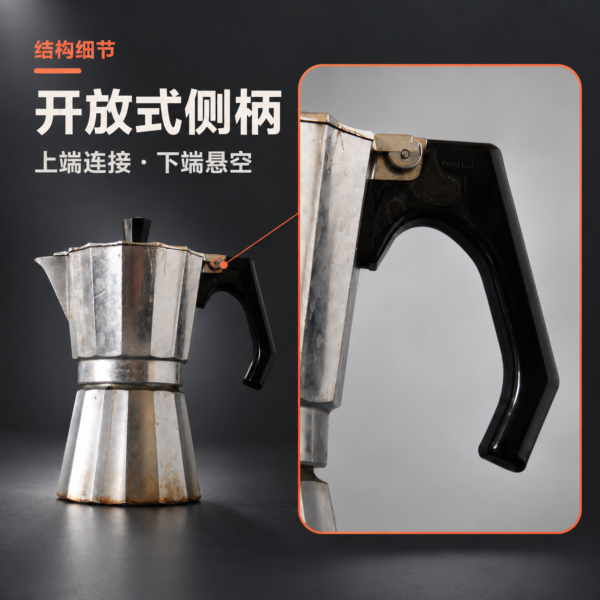
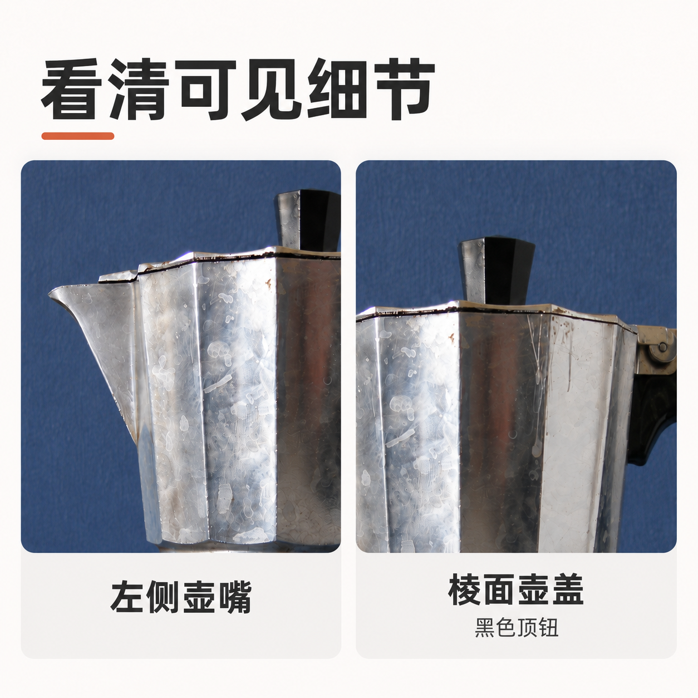
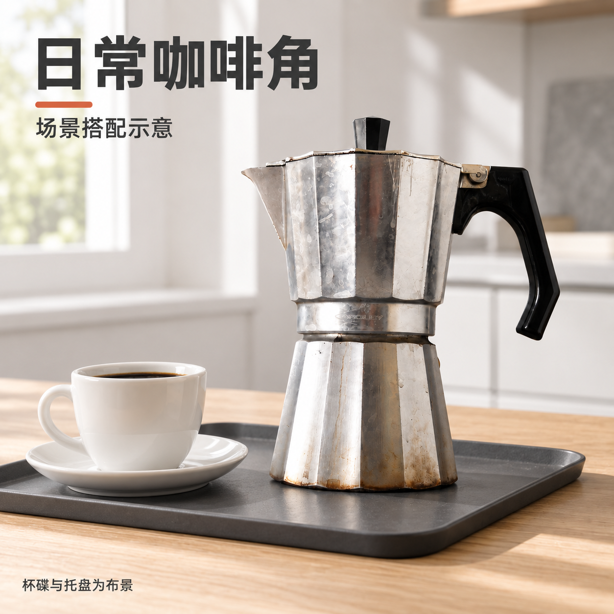

# 0.3.0：参考实际电商套图后的样例

这轮根据京东绿联、小米商城电水壶、Amazon 绿联及 Bialetti 摩卡壶商品页，提炼图位分工、商品占比、标题层级、局部对应和使用场景，再用于自己的真实照片。实际商品与参考品牌不同，没有移植其品牌、参数、认证或包装。

源照片仍为 Alexandre Albore 的公有领域摩卡壶实拍，方便与前一轮比较。保留旧痕；图片执行仍使用 Codex 内置工具。

## 新版四张图

### 1. 商品概览：先让买家看懂卖的是什么

商品名、整体外形和两项可见结构同时呈现。采用大主体、清晰无衬线标题与少量橙色强调，概览图副标题已调整间距，避开壶嘴。

### 2. 侧柄特点：一句说明有对应的实物依据

左下全貌定位，右侧放大同一侧柄，解释上端连接、下端悬空。没有把外观特点扩写成防烫、人体工学或其他未经提供的性能。

### 3. 可见细节：按原照已有角度展示

分别显示左侧壶嘴、壶盖轮廓与黑色顶钮。初版曾补出新的俯视盖面，审图判为需要修改；第二版已恢复接近原始照片的前视。

### 4. 场景搭配：让商品进入可识别的日常环境

使用咖啡角台面、杯碟与托盘，商品仍为原来的摩卡壶。图片写明杯碟与托盘是布景，不表示包含在售卖清单中。

## 相比上一轮，具体变在哪里

| 上一轮主要表达 | 本轮增加的表达 |
| --- | --- |
| 场景氛围与情绪标题 | 商品识别和清楚的结构说明 |
| 多张全貌构图 | 概览、全貌+局部、细节组合、真实场景分别分工 |
| 配色与字体统一 | 进一步统一标题/标注规则，并为每张写买家问题与商品依据 |

这不是把灰色、橙色和粗黑体固定成新模板。它们只是这件银黑商品的本次方案。以后按商品、品牌、用途与实际参考适配。

## 实测结论

4 个新图位，6 次真实内置图片调用，包含两次定点修正；6 个成图文件均为 1254 × 1254 PNG，并通过本次方图、尺寸与文件体积要求。图片与原照均实际查看，记录见 [整套审核](suite-review.md)。

**主要结构与信息表达可以比较，但细微纹理、刻字仍有生成式重构。** 4 个最新图位保持“待核对”，没有自动标成卖家选用；[带状态的原图对照预览](delivery/index.html) 是草稿导出，不代表可以未经确认直接上架。

独立小尺寸/手机预览和本地 HTML 渲染本轮未执行；没有绕过本会话此前的本地页面访问限制。AI 放大图不是新拍摄的真实细节照。

## 下一次怎么使用

> 用 $huoying-suite，参考这个商品链接的套图样式。先看完整图组，学习它的构图、字体层级和内容分工，再用我的商品实拍与参数做一套。不要带入对方的品牌和参数，也不要只换背景、每张写一句口号。

没有参考链接时，也可以说：

> 用 $huoying-studio，按真实电商套图的方法给这件商品做三张：清晰展示、一个有依据的特点、一个使用场景。根据商品选择风格，完成后按整套检查。

[本轮视觉策划](creative-brief.json) · [实际提示与调用](evidence/native-invocations.json) · [原图来源](source.json)
